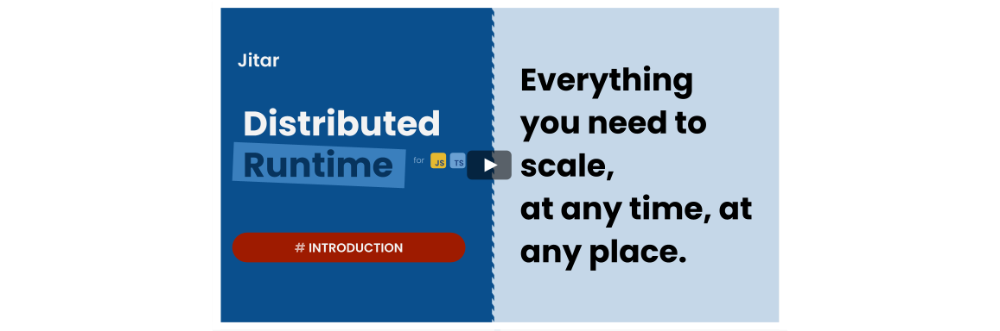

# Jitar - Distributed runtime

Do you always know when and how to scale your applications? Neither do we.

Welcome to [Jitar](https://jitar.dev), a distributed runtime for JavaScript and TypeScript that lets you build your application as a monolith and scale it just-in-time by configuration.

Jitar runs on the server and the web browser, closing the gap between the frontend and backend. All end-to-end communication is automated with type-safety. You can call your server functions directly, Jitar takes care of the rest.

In contrast to other solutions, there is no trace of Jitar in the application code, ensuring platform and framework agnosticism for easy integration and safety.

**🏁 Try Jitar:** see our [Quick Start](https://docs.jitar.dev/introduction/quick-start.html)

**⭐ Give us a star** to show your support.

**👋 Have questions?** Join our [discord community](https://discord.gg/Bqwy8azp5R).

# How it works

Building scalable applications is hard. It requires breaking an application into independently deployable pieces, like microservices. The boundaries of these pieces are sensitive to change and aren't always clear. Developing endpoints and requests to arrange the communication between them brings a lot of overhead.

Jitar is designed to solve these problems. It makes the boundaries configurable so you can change them painlessly at any time and eliminates the overhead by automating the end-to-end communication.

For breaking applications into distributable pieces, Jitar uses a segmentation system. A segment defines what functions need to be deployed together. Jitar connects these segments by creating RPC endpoints and requests under the hood.

# Key benefits

Developers are at the heart of every application. Jitar is designed to make their lives easier and more productive.

* **API automation** - Automates all client-server communication.
* **E2E type-safety** - Reduces programming and refactoring errors.
* **Configuration only** - Keeping the code clean, simple and focussed.
* **E2E Intellisense** - Speeds up developing full-stack apps.
* **Platform agnostic** - Runs in modern web browsers, servers and on the server.
* **Framework agnostic** - Works with every frontend and backend framework.

# Key features

Build a monolith, deploy as microservices. Jitar provides powerful features to scale endlessly.

* **Segmentation** - Breaks applications into deployable bundles.
* **Orchestration** - Coordinates running segmented procedures.
* **Load balancing** - Balances the execution of procedures automatically.
* **Access protection** - Protects the access to private procedures.
* **Transportation** - (De)serializes data automatically.
* **Multi-version** - Supports multiple versions of the same procedure.
* **Integration** - Integrates in any existing landscape.
* **And more** - Validation, health checks, middleware, hooks, etc.

# When to use

Jitar is a great tool for building applications that are expected to grow and change over time. It can be used for building small to large API driven (web) applications, like:

* Full-stack applications
* Microservices

For existing applications, Jitar can be of great assistance for load balancing (parts) of the application, or adding multi-version support.

# Getting started

Getting started with Jitar is as easy as pie. It only takes a few simple steps.

1. **Create new project** - Start fast with our creator and pick one of our templates for Vue, React or Jitar only.
1. **Add your functions** - Write functions and export them like you are used to.
1. **Configure what runs on the server** - Add the exported functions to a server segment configuration file.
1. **Run your application** - Jitar will take care of the rest.

For a step-by-step tutorial, see the [Quick Start](https://docs.jitar.dev/introduction/quick-start.html).

# Documentation

Full documentation is available at [docs.jitar.dev](https://docs.jitar.dev).

Please join our [Discord community](https://discord.gg/Bqwy8azp5R) for questions and discussions.

# Publications

* [The Anatomy of a Distributed JavaScript Runtime — Series](https://medium.com/javascript-in-plain-english/the-anatomy-of-a-distributed-javascript-runtime-part-i-4d550f1f5bbe)
* [How I Speed Up Full-stack Development by Not Building APIs](https://medium.com/better-programming/how-i-speed-up-full-stack-development-by-not-building-apis-7f768335bec6)
* [How I Split a Monolith Into Microservices Without Refactoring](https://medium.com/better-programming/how-i-split-a-monolith-into-microservices-without-refactoring-5d76924c34c2)

# Contributing

We welcome contributions to Jitar. Please read our [contributing guidelines](CONTRIBUTING.md) for more information.

A special thanks to everyone who has contributed to Jitar so far!

- [Yusuf-YENICERI](https://github.com/Yusuf-YENICERI)
- [Tawakal](https://github.com/tawakal)

# Roadmap

We are working hard towards a stable 1.0 release. Details can be found in our [roadmap](ROADMAP.md) document.
